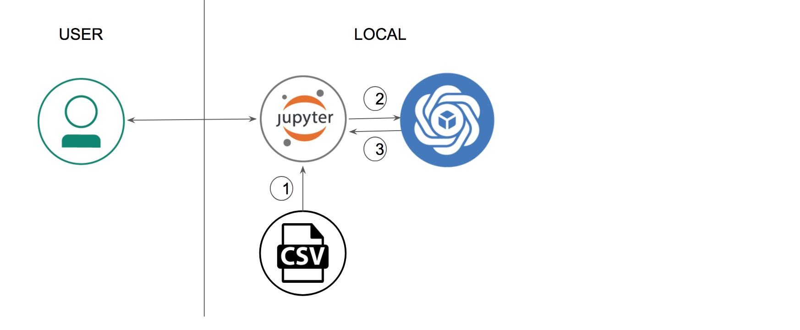
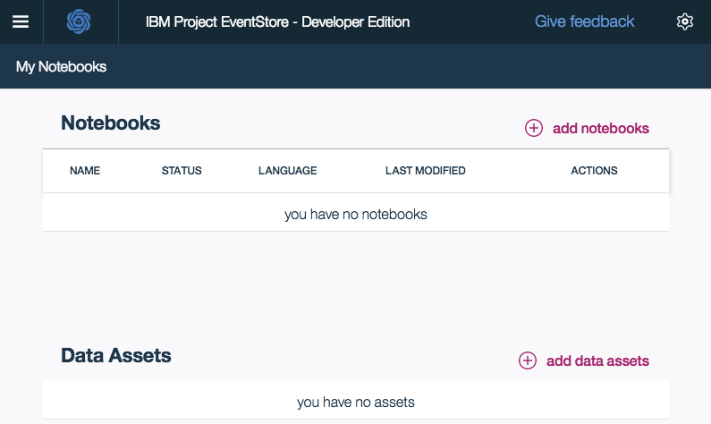
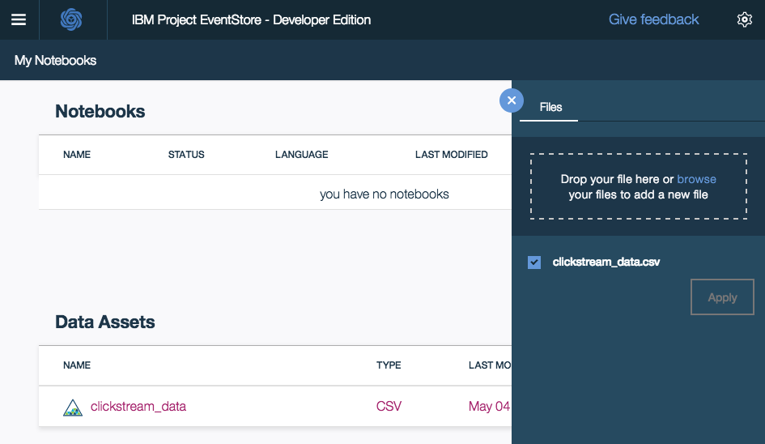
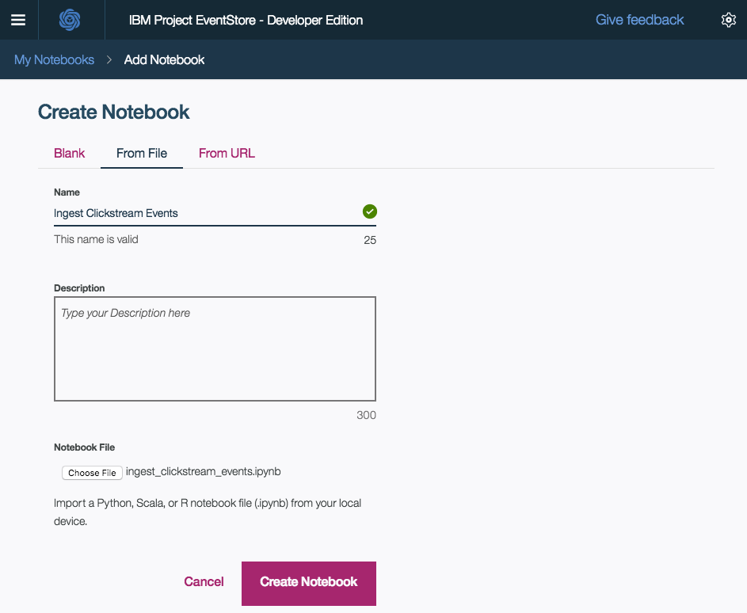
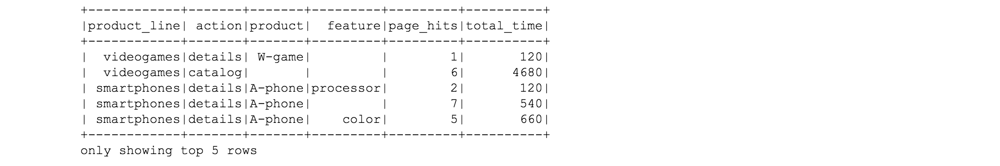
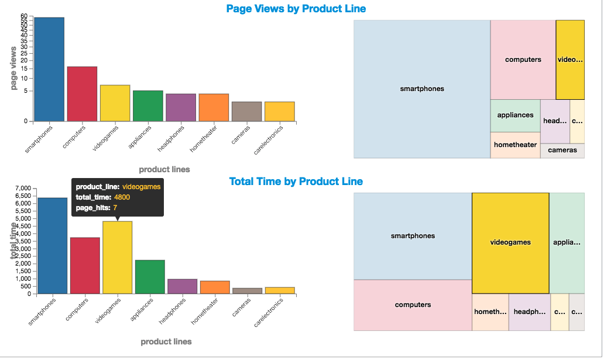
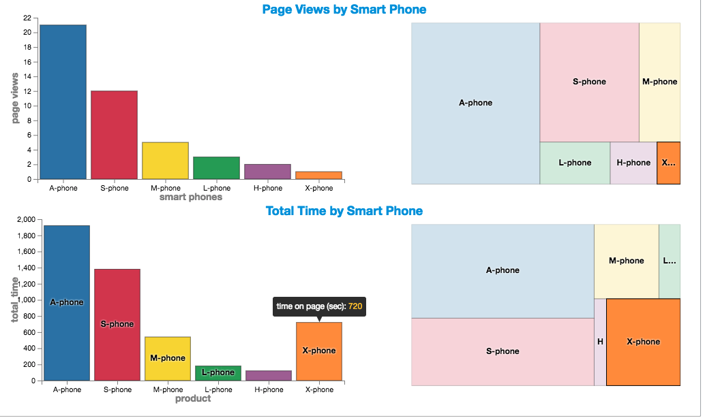
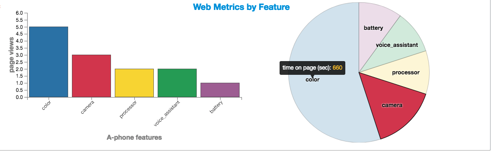
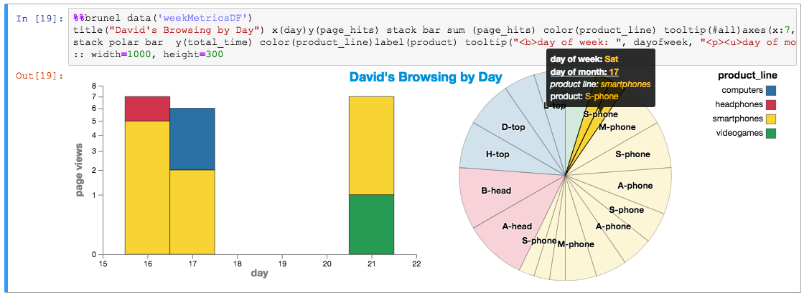

# Clickstream Analysis with IBM Db2 Event Store

IBM Db2 Event Store offers high-speed ingestion and real-time analytics for large
volumes of streaming data. The platform enables event-driven applications to
persist event data at scale and powers high performance Spark analytics on all
data for quick insights. In this Code Pattern, we will see how a retail business
uses IBM Db2 Event Store to capture and analyze clickstream data from its web
channels. The clickstream analysis helps the business to closely track customer
browsing patterns and better understand their changing interests. Acting on these
insights, the business offers a personalized experience for every customer with
targeted offers to drive sales.

Sample notebooks demonstrate the use case of clickstream analysis with
IBM Db2 Event Store using Scala APIs to ingest and analyze web event data.
Credit goes to [Siva Anne](https://github.com/annesiva) of the [IBM Data Science Elite Team](https://github.com/orgs/IBM-DSE) for the original Jupyter Notebooks.

When the reader has completed this code pattern, they will understand how to:
* Install IBM Db2 Event Store developer edition
* Ingest data into Event Store using Scala in a Jupyter Notebook
* Query the Event Store using Scala and Spark SQL in a Jupyter Notebook
* Use Brunel to visualize the data with interactive charts



## Flow
1. Add a CSV file as a data asset
2. Run a Jupyter Notebook using Scala to ingest data from the CSV file into Event Store
3. Run a Jupyter Notebook using Scala and the Brunel visualization language to analyze the data from Event Store

## Included components
* [IBM Db2 Event Store](https://www.ibm.com/us-en/marketplace/db2-event-store): In-memory database optimized for event-driven data processing and analysis.
* [Jupyter Notebook](http://jupyter.org/): An open source web application that allows you to create and share documents that contain live code, equations, visualizations, and explanatory text.
* [Scala](https://www.scala-lang.org/): Scala combines object-oriented and functional programming in one concise, high-level language.
* [Brunel](https://github.com/Brunel-Visualization/Brunel): Brunel defines a highly succinct and novel language that defines interactive data visualizations based on tabular data. 

## Featured technologies
* [Databases](https://en.wikipedia.org/wiki/Database): Repository for storing and managing collections of data.
* [Analytics](https://developer.ibm.com/watson/): Analytics delivers the value of data for the enterprise.
* [Data Science](https://medium.com/ibm-data-science-experience/): Systems and scientific methods to analyze structured and unstructured data in order to extract knowledge and insights.

# Watch the Video
[](https://www.youtube.com/watch?v=XJmRDmZ6VDs)

# Steps

## Run locally

1. [Install IBM Db2 Event Store Developer Edition](#1-install-ibm-db2-event-store-developer-edition)
2. [Clone the repo](#2-clone-the-repo)
3. [Add the CSV file as a data asset](#3-add-the-csv-file-as-a-data-asset)
4. [Import and run the Jupyter Notebook to ingest data](#4-import-and-run-the-jupyter-notebook-to-ingest-data)
5. [Import and run the Jupyter Notebook to analyze the data](#5-import-and-run-the-jupyter-notebook-to-analyze-the-data)
6. [See the results](#6-see-the-results)

### 1. Install IBM Db2 Event Store Developer Edition

Install IBM® Db2® Event Store Developer Edition on Mac, Linux, or Windows by following the instructions [here.](https://www.ibm.com/support/knowledgecenter/en/SSGNPV/eventstore/desktop/install.html)

> Note: This code pattern was developed with Event Store Developer Edition 1.1.4

### 2. Clone the repo

Clone the `db2-event-store-clickstream` locally. In a terminal, run:

```
git clone https://github.com/IBM/db2-event-store-clickstream
```

### 3. Add the CSV file as a data asset

Use the Db2 Event Store UI to add the CSV input file as a data asset.

1. From the drop down menu (three horizontal lines in the upper left corner), select `My Notebooks`.

   

1. Click on `add data assets`.

   

1. Click `browse` and navigate to the `data` directory in your cloned repo. Select the file `clickstream_data.csv`.

   

### 4. Import and run the Jupyter Notebook to ingest data

#### Import the notebook

Use the Db2 Event Store UI to create the notebook.

1. From the drop down menu (three horizontal lines in the upper left corner), select `My Notebooks`.
1. Click on `add notebooks`.
1. Select the `From File` tab.
1. Provide a name.
1. Click `Choose File` and navigate to the `notebooks` directory in your cloned repo. Select the file `ingest_clickstream_events.ipynb`.
1. Scroll down and click on `Create Notebook`.

   

#### Run the notebook

1. Edit the `HOST` constant in the first code cell. You will need to enter your host's IP address in place of the `XXX.XXX.XXX.XXX` value.

1. Run the notebook using the menu `Cell` > `Run all` or run the cells individually with the `play` button.

This notebook demonstrates how to:

* Connect to Event Store
* Create a database
* Drop a database
* Create a table
* Load data from a CSV file or a DataFrame

### 5. Import and run the Jupyter Notebook to analyze the data

#### Import the notebook

Use the Db2 Event Store UI to create the notebook.

* Follow the same steps as above, but select the file `analyze_clickstream_events.ipynb` from your repo's `notebooks` directory.

#### Run the notebook

1. Edit the `HOST` constant in the first code cell. You will need to enter your host's IP address in place of the `XXX.XXX.XXX.XXX` value.

1. Run the notebook using the menu `Cell` > `Run all` or run the cells individually with the `play` button.

This notebook demonstrates how to:

* Connect to Event Store
* Query Event Store using Spark SQL
* Prepare and aggregate data for analysis
* Use Brunel to create interactive charts

### 6. See the results

* Code cells that prepare DataFrames with calculated and aggregated fields include show() output to give you a peek at the data as it is being processed.

  

* The first Brunel charts use aggregated web metris for product lines. Here we show 4 charts to help you compare page views with time spent on web pages.

  * The bar charts use the same order and color for product lines (sorted by page hits). The charts are placed with one directly below the other so that your eyes will easily spot where they differ.

    * The charts show that `smart phones` web pages are the most popular in both page views and time spent on pages.

    * `videogames` stands out as a product line with significantly higher `total time` relative to its `page hits`.

  * Notice the tooltips when you hover over the bars.

  * Click on the `videogames` bar.

    * The charts are wired so that when you select a bar, it will highlight that product line's area in the treemap charts. The treemap charts, on the right side, show another way to visualize the relative stats of the product lines. The top one is weighted by page views. The bottom one is weighted by time spent on web pages.

  

* The next Brunel charts show aggregated web metris for products in the `smart phones` product line. Here we show 4 charts similar to those described above.

  * These charts show that the `A-phone` is the leading smart phone product in terms of both page hits and time spent on a page.

  * Notice that the `X-phone` stands out as the phone with higher time spent on web pages per page view.

  

* Next we look at specific features of the `A-phone`.

  * Here we use a bar chart to show page views by feature and a pie chart to show time spent on pages.

    * Clicking on a bar will highlight the same feature in the pie chart.

    * The tool tips show additional information when hovering over bars or pie slices.

    * `color` was the most important feature for both page views and time spent on web pages.

  

* Finally, after more data manipulation, we look into web metrics for a specific user.

  * This view could be used by a support agent or a targeted offering campaign to analyze a user's current interests.

    * This user has shown significant interest in smart phones.
    * This user has also visited web pages for headphones and computers.

  * A legend is displayed on the right. Color is by product line.

  * The bar chart shows the user's page views over the past seven days. A stacked bar is used to show each product line viewed.

  * Clicking on a bar will highlight the pie chart slices for that day and that product line.
    * The pie slices are also divided by day and product.
    * The pie chart tool-tip shows how you can use HTML tags for formatting in a tool-tip.

  

# Sample output

See the notebook with example output and **interactive charts** [here](http://nbviewer.jupyter.org/github/IBM/db2-event-store-clickstream/blob/master/data/examples/analyze_clickstream_events.ipynb).

# Links
* [**Ingest and Analyze Streaming Event Data at Scale with IBM Db2 EventStore**](http://www.ibmbigdatahub.com/blog/ingest-and-analyze-streaming-event-data-scale-ibm-eventstore)
* [**Fast Data Ingestion, ML Equates to Smarter Decisions Faster**](https://www.ibm.com/blogs/think/2018/03/db2-event-store/)
* [**IBM Db2 Event Store Solution Brief**](https://www-01.ibm.com/common/ssi/cgi-bin/ssialias?htmlfid=09014509USEN&)
* [**Overview of IBM Db2 Event Store Enterprise Edition**](https://www.ibm.com/support/knowledgecenter/en/SSGNPV/eventstore/local/overview.html#overview)
* [**Developer Guide for IBM Db2 Event Store Client APIs**](https://www.ibm.com/support/knowledgecenter/en/SSGNPV/eventstore/desktop/dev-guide.html)
* [**IBM Marketplace**](https://www.ibm.com/us-en/marketplace/db2-event-store)
* [**Getting Started with Scala and sbt**]( https://docs.scala-lang.org/getting-started-sbt-track/getting-started-with-scala-and-sbt-on-the-command-line.html)

# Learn more
* **Data Analytics Code Patterns**: Enjoyed this Code Pattern? Check out our other [Data Analytics Code Patterns](https://developer.ibm.com/code/technologies/data-science/)
* **AI and Data Code Pattern Playlist**: Bookmark our [playlist](https://www.youtube.com/playlist?list=PLzUbsvIyrNfknNewObx5N7uGZ5FKH0Fde) with all of our Code Pattern videos
* **Data Science Experience**: Master the art of data science with IBM's [Data Science Experience](https://datascience.ibm.com/)

# License
[Apache 2.0](LICENSE)
